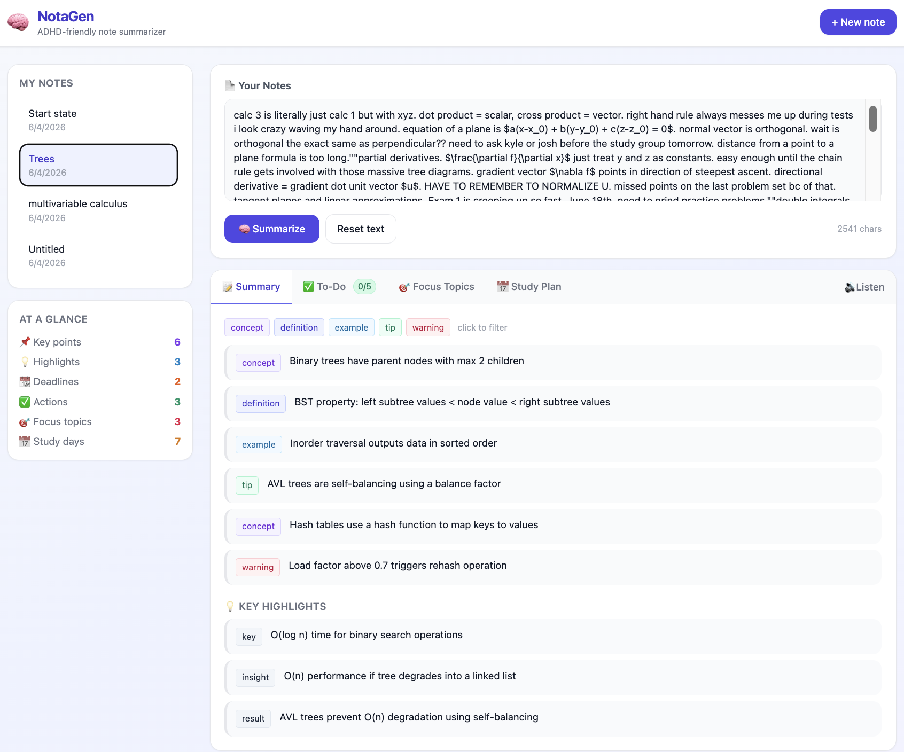
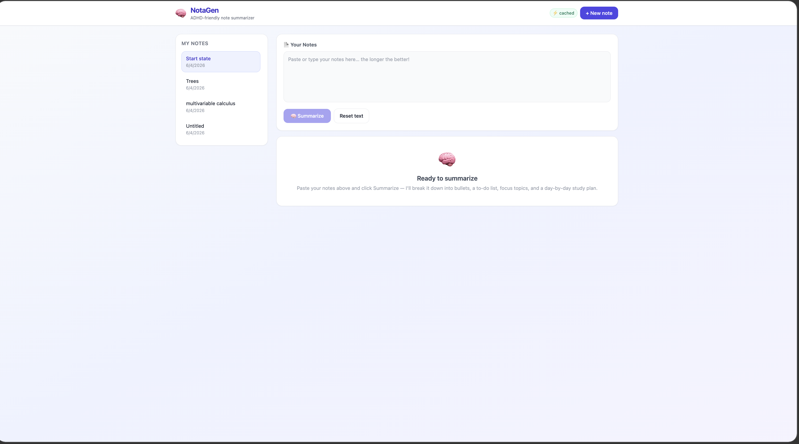
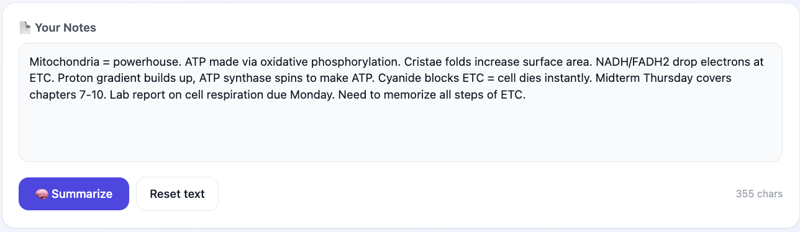
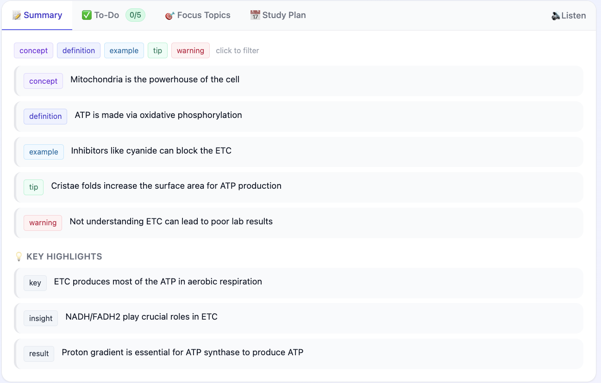
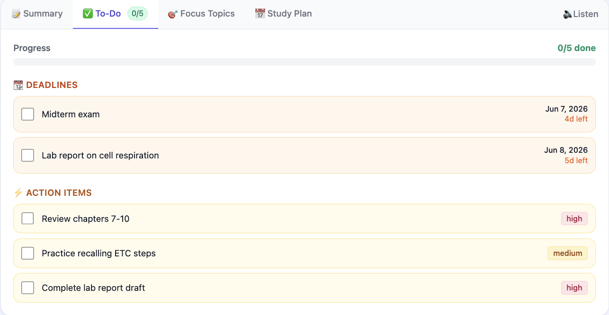
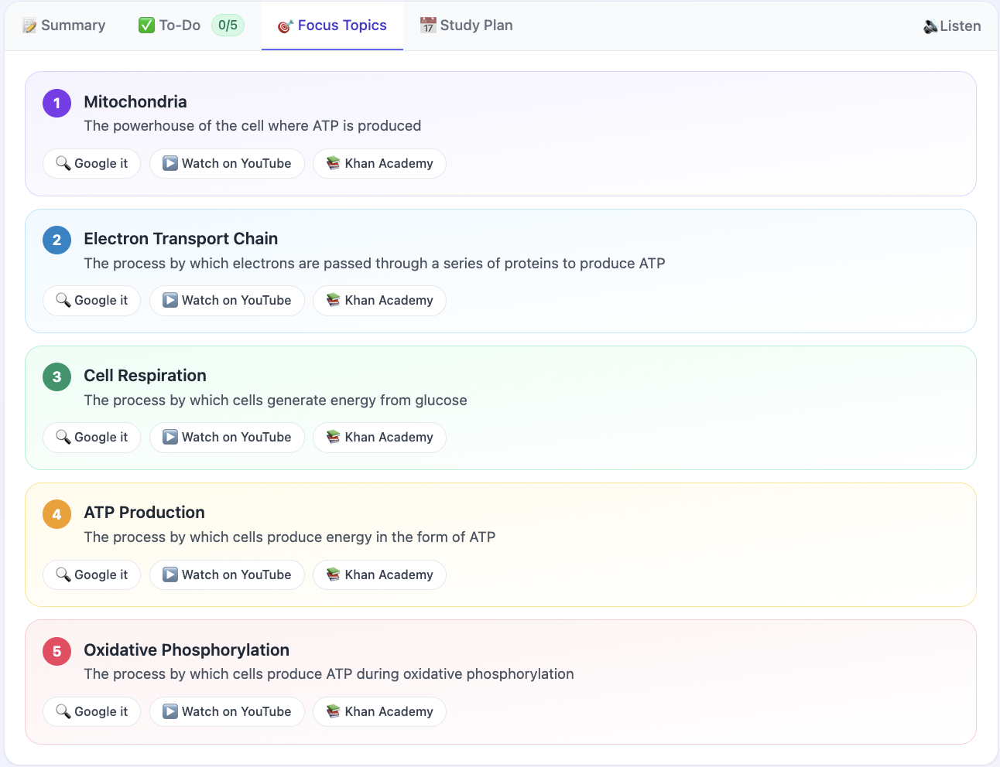
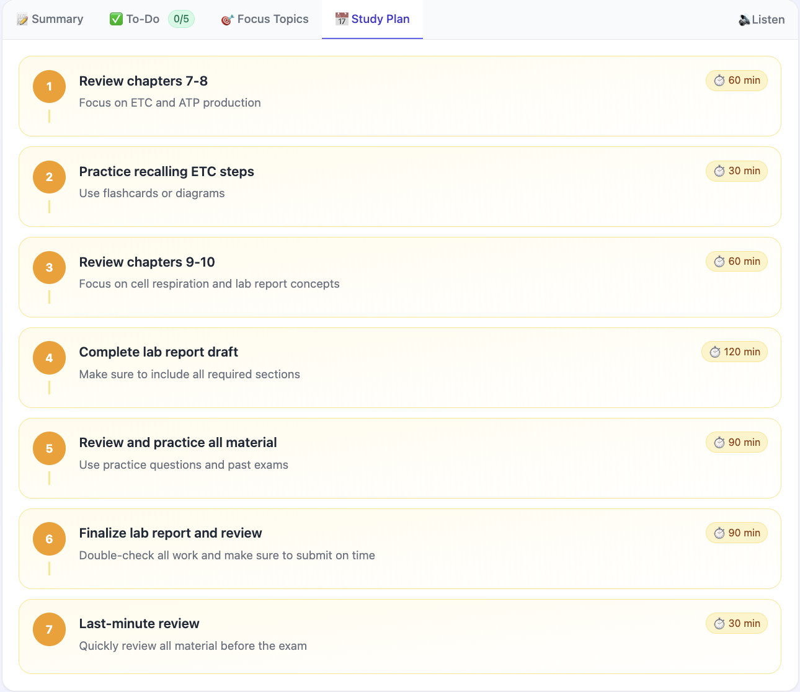
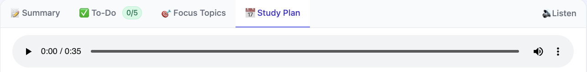
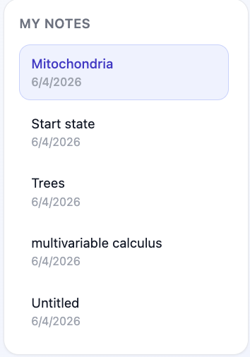

# NotaGen — AI-Powered ADHD Note Summarizer

> Transform dense lecture notes and readings into structured, scannable summaries — built specifically for how ADHD brains actually process information.



[](https://www.typescriptlang.org/)
[](https://react.dev/)
[](https://nodejs.org/)
[](https://www.postgresql.org/)
[](https://redis.io/)
[](https://docs.docker.com/compose/)
[](https://aws.amazon.com/elasticbeanstalk/)

---

## What It Does

Students with ADHD struggle with wall-of-text notes. NotaGen pipes raw notes through a large language model and returns:

- **Bullet summaries** categorized as concepts, definitions, examples, tips, and warnings
- **Key highlights** — the most important sentences, pre-highlighted for scanning
- **Actionable to-do list** — deadlines extracted and surfaced with priority tags
- **Focus topics** — 3–6 key areas to study, each with a one-click Google search query
- **5–7 day study plan** — specific daily tasks with time estimates
- **Text-to-speech playback** — AWS Polly Neural TTS so you can listen while you walk

All results stream in real-time via Server-Sent Events. The backend caches summaries in Redis so repeated lookups are instant.

---

## Screenshots

### Empty State — Clean, Distraction-Free Landing


### Paste Your Notes


### Summary Tab — Bullets + Highlights


### To-Do Tab — Extracted Deadlines as Checkable Tasks


### Focus Topics — What to Study With Search Links


### Study Plan — Day-by-Day Breakdown


### Text-to-Speech — Listen to Your Summary


### Sidebar — All Your Past Notes


---

## Architecture

```
┌─────────────────────────────────────────────────────────────┐
│                        Browser (Vite + React 18)            │
│  ┌──────────┐  ┌──────────┐  ┌───────────┐  ┌───────────┐  │
│  │ Summary  │  │  To-Do   │  │  Focus    │  │  Study    │  │
│  │   Tab    │  │   Tab    │  │  Topics   │  │   Plan    │  │
│  └──────────┘  └──────────┘  └───────────┘  └───────────┘  │
│         │              Server-Sent Events (SSE)             │
└─────────┼───────────────────────────────────────────────────┘
          │ HTTP + EventStream
┌─────────▼───────────────────────────────────────────────────┐
│                    Express API (Node 20 / TS)                │
│                                                             │
│  POST /api/notes          GET /api/notes/:id/summary        │
│  GET  /api/notes          GET /api/notes/:id/tts            │
│                                                             │
│  ┌─────────────┐    ┌─────────────┐    ┌─────────────────┐  │
│  │  Prisma ORM │    │   ioredis   │    │  OpenAI SDK →   │  │
│  │ (PostgreSQL)│    │  (Redis 7)  │    │  Groq API       │  │
│  └─────────────┘    └─────────────┘    └─────────────────┘  │
│                                                             │
│  ┌─────────────────────────────────────────────────────┐    │
│  │            AWS Polly Neural TTS (streaming)         │    │
│  └─────────────────────────────────────────────────────┘    │
└─────────────────────────────────────────────────────────────┘
          │                          │
┌─────────▼──────────┐   ┌───────────▼──────────┐
│   PostgreSQL 16     │   │      Redis 7          │
│  (persistent notes, │   │  (summary cache,      │
│   summaries, users) │   │   TTL-based eviction) │
└────────────────────┘   └──────────────────────┘
```

### Key Design Decisions

| Decision | Why |
|---|---|
| **Groq + llama-3.3-70b-versatile** | 500+ tok/s inference — fast enough for real-time SSE streaming without buffering |
| **OpenAI SDK pointed at Groq** | Zero vendor lock-in; swap `baseURL` to change providers in one line |
| **Async generator streaming** | `for await (chunk of stream)` pipes tokens directly to SSE without accumulating in memory |
| **SHA-256 content hash as cache key** | Same note text always hits the same Redis key; TTL=24h keeps results fresh |
| **ioredis pipelining** | `enableAutoPipelining: true` batches Redis commands automatically — critical for 500+ req/sec targets |
| **Prisma + PostgreSQL** | Typed schema, migrations, and JSONB storage for structured summary output |
| **Multi-stage Docker builds** | API: Node 20 Alpine → lean prod image; Client: Vite build → Nginx with SPA routing |
| **AWS Polly Neural TTS** | Chunked `audio/mpeg` streaming — audio starts playing before the full file is ready |

---

## Tech Stack

| Layer | Technology |
|---|---|
| Frontend | React 18, TypeScript, Vite, Tailwind CSS |
| Backend | Node.js 20, Express, TypeScript |
| LLM | Groq API (llama-3.3-70b-versatile) via OpenAI SDK |
| Database | PostgreSQL 16, Prisma ORM |
| Cache | Redis 7, ioredis |
| TTS | AWS Polly Neural Engine |
| Streaming | Server-Sent Events (SSE) |
| Containers | Docker, Docker Compose |
| CI/CD | GitHub Actions → AWS ECR → Elastic Beanstalk |
| Infra | AWS EB multi-container, ECR |

---

## Quick Start

### Prerequisites
- Docker Desktop
- A [Groq API key](https://console.groq.com) (free tier available)
- AWS credentials with Polly access (for TTS)

### 1. Clone and configure

```bash
git clone https://github.com/your-username/notagen-ai-adhd-note-summarizer.git
cd notagen-ai-adhd-note-summarizer
cp .env.example .env
```

Edit `.env` and fill in your keys:

```bash
GROQ_API_KEY=gsk_your_key_here
AWS_ACCESS_KEY_ID=your_access_key
AWS_SECRET_ACCESS_KEY=your_secret_key
```

### 2. Start everything

```bash
docker compose up --build
```

This spins up PostgreSQL, Redis, the API server, and the React client. First build takes ~2 minutes.

### 3. Open the app

```
http://localhost:5173
```

The API runs on port `8080`. The client proxies `/api` requests automatically.

---

## Environment Variables

| Variable | Required | Default | Description |
|---|---|---|---|
| `PORT` | No | `8080` | API server port |
| `NODE_ENV` | No | `development` | `development` or `production` |
| `WEB_ORIGIN` | Yes | — | CORS origin for the React client |
| `DATABASE_URL` | Yes | — | PostgreSQL connection string |
| `GROQ_API_KEY` | Yes | — | Groq API key (`gsk_...`) |
| `GROQ_MODEL` | No | `llama-3.3-70b-versatile` | Groq model to use |
| `REDIS_URL` | Yes | — | Redis connection URL |
| `SUMMARY_TTL_SECONDS` | No | `86400` | Summary cache TTL (24h) |
| `NOTE_TTL_SECONDS` | No | `300` | Individual note cache TTL |
| `NOTES_LIST_TTL_SECONDS` | No | `60` | Notes list cache TTL |
| `AWS_REGION` | Yes | `us-east-1` | AWS region for Polly |
| `AWS_ACCESS_KEY_ID` | Yes | — | AWS access key |
| `AWS_SECRET_ACCESS_KEY` | Yes | — | AWS secret key |

> **Security note:** Never commit `.env`. It is gitignored by default. Use `.env.example` with placeholder values for version control.

---

## API Reference

### Notes

```
POST   /api/notes              Create a note
GET    /api/notes              List all notes (paginated)
GET    /api/notes/:id          Get a single note
DELETE /api/notes/:id          Delete a note
```

### Summarization

```
GET /api/notes/:id/summary          Full summary (cached JSON)
GET /api/notes/:id/summary?stream=1  Real-time SSE stream of tokens
```

**SSE stream format:**
```
data: {"chunk": "{\n  \"bullets\":"}
data: {"chunk": " [{\"text\": \"Key concept..."}
data: [DONE]
```

### Text-to-Speech

```
GET /api/notes/:id/tts    Streams audio/mpeg via AWS Polly Neural
```

---

## Data Model

```sql
-- Notes table
notes (
  id         UUID PRIMARY KEY DEFAULT gen_random_uuid(),
  content    TEXT NOT NULL,
  hash       TEXT UNIQUE NOT NULL,  -- SHA-256 for cache keying
  summary    JSONB,                 -- Cached structured summary
  created_at TIMESTAMPTZ DEFAULT now(),
  updated_at TIMESTAMPTZ DEFAULT now()
)
```

The `summary` JSONB column stores the full structured output:

```typescript
type Summary = {
  bullets:   { text: string; category: "concept" | "definition" | "example" | "tip" | "warning" }[];
  highlights:{ text: string; category: "key" | "insight" | "result" | "quote" }[];
  deadlines: { label: string; due: string; category: "deadline" }[];
  actions:   { label: string; priority: "low" | "medium" | "high"; category: "action" }[];
  topics:    { name: string; description: string; searchQuery: string }[];
  studyPlan: { day: number; task: string; duration: string; notes: string }[];
}
```

---

## Caching Strategy

Redis sits in front of the LLM call:

```
Request → hash note content (SHA-256)
        → check Redis key
            ↓ HIT  → return cached JSON immediately
            ↓ MISS → call Groq API → stream to client → write to Redis + PostgreSQL
```

TTLs are tunable via environment variables. The default 24-hour summary TTL means identical notes are free after the first call.

---

## Deployment

### Docker Compose (local / single server)

```bash
docker compose up -d
```

### AWS Elastic Beanstalk (multi-container)

The repo includes a `Dockerrun.aws.json` for EB multi-container deployments. Images are pushed to ECR and EB pulls them on deploy.

### GitHub Actions CI/CD

Push to `main` triggers:

1. Build and tag Docker images
2. Push to ECR (`notagen-api`, `notagen-client`)
3. Deploy to Elastic Beanstalk (`notagen` app, `Notagen-env`)

Required GitHub secrets:

```
AWS_ACCESS_KEY_ID
AWS_SECRET_ACCESS_KEY
GROQ_API_KEY
```

---

## Project Structure

```
notagen-ai-adhd-note-summarizer/
├── src/
│   ├── lib/
│   │   ├── openai.ts        # Groq client, prompt builder, async streaming
│   │   ├── redis.ts         # ioredis client with auto-pipelining
│   │   ├── prisma.ts        # Prisma client singleton
│   │   └── types.ts         # Shared TypeScript types
│   ├── routes/
│   │   ├── notes.ts         # CRUD endpoints
│   │   ├── summarize.ts     # SSE streaming endpoint
│   │   └── tts.ts           # AWS Polly TTS endpoint
│   └── index.ts             # Express app + middleware
├── client/
│   ├── src/
│   │   ├── App.tsx          # Main UI with 4-tab ADHD layout
│   │   ├── normalize.ts     # Summary response normalization
│   │   └── types.ts         # Frontend type definitions
│   ├── Dockerfile           # Vite build → Nginx
│   └── nginx.conf           # SPA routing config
├── prisma/
│   └── schema.prisma        # Database schema
├── images/                  # Screenshots for this README
├── .github/
│   └── workflows/
│       └── deploy.yml       # CI/CD pipeline
├── Dockerfile               # API multi-stage build
├── docker-compose.yml       # Full local stack
├── Dockerrun.aws.json       # EB multi-container config
└── .env.example             # Environment variable template
```

---

## ADHD-First Design Principles

- **Tab-based navigation** — one cognitive context at a time, no overwhelming walls of content
- **Color-coded categories** — concepts, tips, and warnings each have distinct visual treatment
- **Checkable to-dos** — deadlines become tasks you can cross off, not just text to stare at
- **One-click search** — focus topics link directly to targeted Google queries
- **Audio option** — TTS for auditory learners or when reading feels impossible
- **Short, scannable text** — the LLM prompt explicitly asks for brief bullets, not paragraphs


